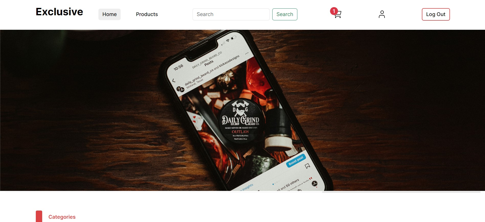

# React E-commerce Project

## Table of Contents

- [Introduction](#introduction)
- [Features](#features)
- [Usage](#usage)
- [Technologies Used](#technologies-used)
- [API Integration](#api-integration)
- [Demo](#demo)

## Introduction

Welcome to the React E-commerce Project(Exclusive)! This is a fully functional e-commerce web application built using React. The project focuses on creating a user-friendly front-end that interacts with a comprehensive backend API.

## Features

- User authentication (sign up, login, change password, logout)
- Product listing with pagination
- Product detail view
- Shopping cart functionality
- Order management
- Browse products by category

## Usage

1. **User Authentication**: Sign up and log in to your account.
2. **Browse Products**: View the list of available products.
3. **Product Details**: Click on a product to see its details.
4. **Shopping Cart**: Add products to your cart and manage them.
5. **Checkout**: Proceed to checkout and complete your order.

## Technologies Used

- **Frontend**:
  - React
  - useContext (React Context API)
  - React Router Dom
  - Axios
  - Bootstrap

## API Integration

This project uses a comprehensive backend API provided by **[Knowledge Academy](https://www.linkedin.com/company/eknowledge-learn/)** for various functionalities such as user authentication, product management, order management, and more.

## Demo

You can check out the live demo of the project [here](https://react-e-commerce-project-op5j.onrender.com/).

